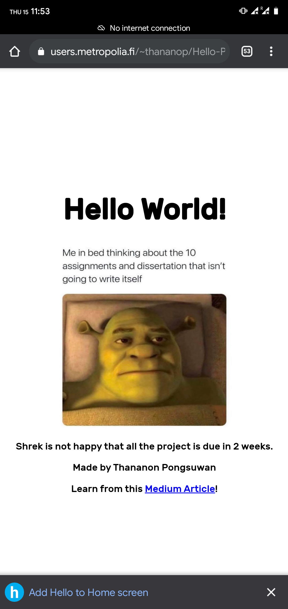
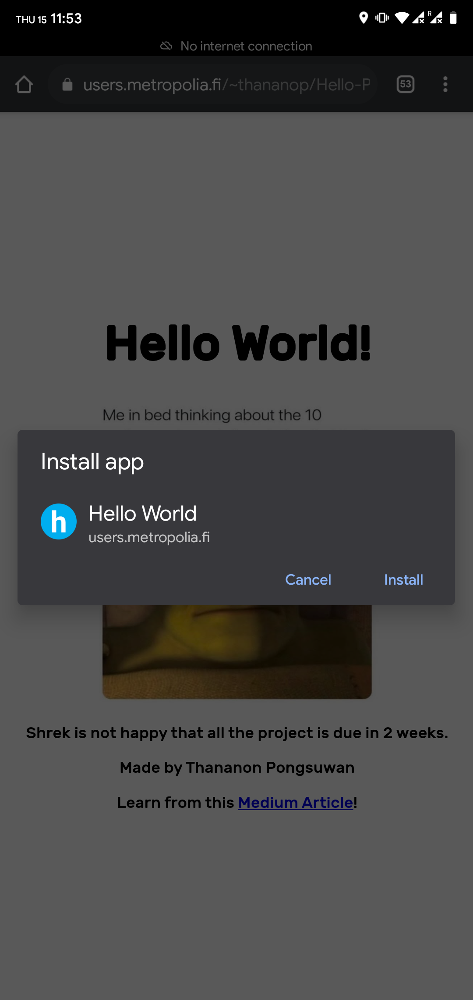
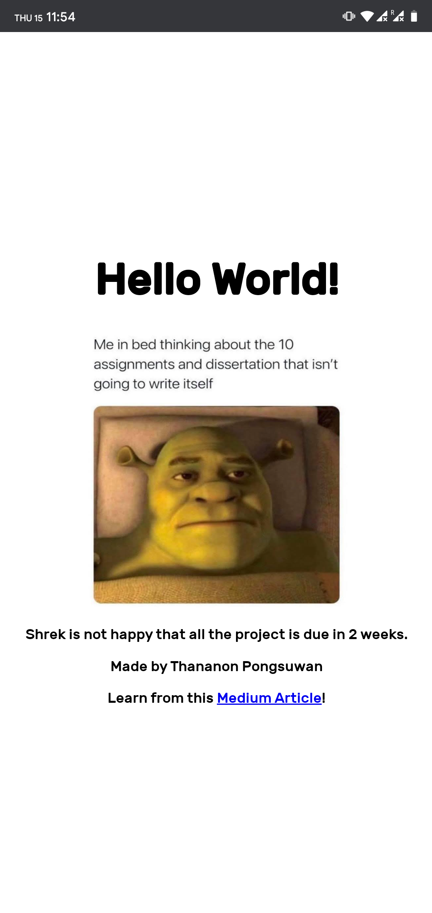

# Week-5-Hello-PWA

## About
Use of Service Worker to cache the resources. [GitLab task page ](https://gitlab.metropolia.fi/ilkkamtk/sssf-course/-/blob/master/week5/pwa.md)

## Screenshot
")
Lighthouse Test

")
Hello world PWA on users.metropolia.fi (online)

Hello world PWA on users.metropolia.fi (offline)

Install as web app

Open as a app from homescreen